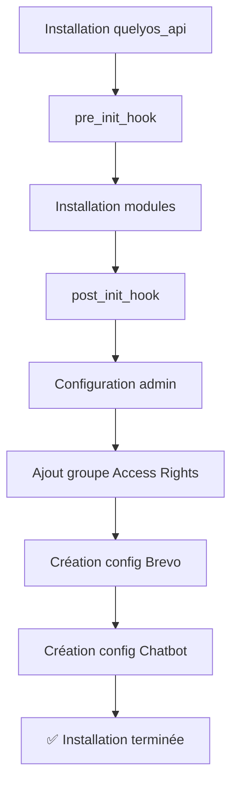

# 🤖 Configuration Automatique - Quelyos Suite

## 📋 Vue d'Ensemble

Lors de l'installation de `quelyos_api`, le `post_init_hook` configure **automatiquement** :

1. ✅ Utilisateur admin avec accès complet
2. ✅ Association au tenant par défaut
3. ✅ Groupe super-admin (Access Rights)
4. ✅ Configuration Brevo (placeholder)
5. ✅ Configuration Chatbot/AI (placeholder)

## 🔧 Détails des Configurations

### 1. Plans Tarifaires

**Plans créés automatiquement** (via `subscription_plan_data.xml`) :

#### Plan Starter
```python
{
    'name': 'Starter',
    'code': 'starter',
    'price_monthly': 29.0,
    'price_yearly': 278.4,  # -20% sur l'annuel
    'max_users': 1,
    'max_products': 1000,
    'max_orders_per_year': 5000,
    'support_level': 'email_48h',
    'is_popular': False,
}
```

#### Plan Pro ⭐ (POPULAIRE)
```python
{
    'name': 'Pro',
    'code': 'pro',
    'price_monthly': 79.0,
    'price_yearly': 758.4,  # -20% sur l'annuel
    'max_users': 5,
    'max_products': 10000,
    'max_orders_per_year': 50000,
    'support_level': 'email_chat_24h',
    'is_popular': True,
}
```

#### Plan Enterprise
```python
{
    'name': 'Enterprise',
    'code': 'enterprise',
    'price_monthly': 0.0,  # Sur devis
    'price_yearly': 0.0,
    'max_users': 0,  # Illimité
    'max_products': 0,  # Illimité
    'max_orders_per_year': 0,  # Illimité
    'support_level': 'dedicated_2h',
    'is_popular': False,
}
```

**Résultat** :
- ✅ 3 plans tarifaires disponibles dès l'installation
- ✅ Vérification automatique dans le post_init_hook
- ✅ Droits d'accès par plan configurés automatiquement

### 2. Utilisateur Admin

**Modifications appliquées** :

```sql
-- Associer admin à la company du tenant
UPDATE res_users
SET company_id = (SELECT company_id FROM quelyos_tenant WHERE name LIKE '%Admin%' LIMIT 1)
WHERE login = 'admin';

-- Mettre à jour les companies accessibles
DELETE FROM res_company_users_rel WHERE user_id = (SELECT id FROM res_users WHERE login = 'admin');
INSERT INTO res_company_users_rel (user_id, cid)
SELECT u.id, t.company_id
FROM res_users u, quelyos_tenant t
WHERE u.login = 'admin' AND t.name LIKE '%Admin%'
LIMIT 1;
```

**Résultat** :
- ✅ Utilisateur admin lié au tenant "Admin Quelyos"
- ✅ Accès à la bonne company

### 3. Groupe Super-Admin

**Groupe ajouté** : `Access Rights`

```sql
INSERT INTO res_groups_users_rel (gid, uid)
SELECT g.id, u.id
FROM res_groups g, res_users u
WHERE g.name::text LIKE '%Access Rights%'
AND u.login = 'admin'
AND NOT EXISTS (
    SELECT 1 FROM res_groups_users_rel r
    WHERE r.gid = g.id AND r.uid = u.id
)
```

**Résultat** :
- ✅ Admin a accès à **TOUS** les modules du dashboard
- ✅ Permissions complètes sur l'ERP

**Modules accessibles** (automatiquement) :
- Home
- Finance
- Store (Boutique)
- Stock
- CRM
- Marketing
- HR (Ressources Humaines)
- POS (Point de Vente)
- Support

### 4. Configuration Brevo

**Modèle** : `quelyos.email.config`

**Enregistrement créé** :
```python
{
    'name': 'Brevo (Sendinblue)',
    'provider': 'brevo',
    'is_active': True,  # ✅ ACTIVÉ par défaut
    'api_key': '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',
    'email_from': 'noreply@quelyos.com',
    'email_from_name': 'Quelyos',
}
```

**État** :
- ✅ Service **activé automatiquement** dès l'installation
- ✅ Clé API Brevo pré-configurée
- 📧 Emails marketing opérationnels immédiatement

### 5. Configuration Chatbot/AI

**Modèle** : `quelyos.ai.config`

**Enregistrement créé** :
```python
{
    'name': 'Groq AI (Chatbot)',
    'provider': 'groq',
    'is_enabled': True,  # ✅ ACTIVÉ par défaut
    'model': 'llama-3.1-70b-versatile',
    'api_key_encrypted': '<chiffré avec Fernet>',  # Clé Groq pré-configurée et chiffrée
    'max_tokens': 800,
    'temperature': 0.7,
}
```

**État** :
- ✅ Service **activé automatiquement** dès l'installation
- ✅ Clé API Groq pré-configurée et chiffrée avec Fernet
- ✅ Modèle Groq : llama-3.1-70b-versatile
- 🤖 Chatbot IA opérationnel immédiatement

## 🎯 Résultat Après Installation

### Dashboard (http://localhost:5175)

**Connexion** :
- Login : `admin`
- Password : `724@Lnb.13`

**Modules visibles** (9 modules) :
```
✅ Home          - Tableau de bord principal
✅ Finance       - Comptabilité, budgets, analytics
✅ Store         - E-commerce, produits, commandes
✅ Stock         - Inventaire, entrepôts, réservations
✅ CRM           - Clients, opportunités, pipeline
✅ Marketing     - Campagnes, automation, analytics
✅ HR            - Employés, présences, congés
✅ POS           - Caisse, terminal, sessions
✅ Support       - Tickets, SLA, satisfaction
```

**Aucune configuration supplémentaire requise** pour accéder au dashboard !

### Super Admin (http://localhost:9000)

**Services Opérationnels Immédiatement** :
- 📧 Brevo : ✅ **ACTIVÉ** avec clé API pré-configurée
- 🤖 Chatbot Groq : ✅ **ACTIVÉ** avec clé API chiffrée pré-configurée

**État actuel** :
- ✅ Configurations créées avec clés API pré-remplies
- ✅ Services **activés automatiquement** (is_active=true, is_enabled=true)
- 🎯 **Aucune action requise** : Tout est opérationnel dès l'installation
- 🔧 Personnalisation possible via Super Admin (modifier clés, modèles, etc.)

## 🔄 Workflow Installation



## 📝 Logs d'Installation

Exemple de logs lors de l'installation :

```
🚀 QUELYOS SUITE - Installation Automatique
================================================================================

🔍 Vérification version Odoo...
✅ Version Odoo validée : 19.0+e

📦 Vérification dépendances Python...
✅ faker installé
✅ qrcode installé
✅ Pillow installé

🔍 Vérification modules OCA...
✅ Module OCA 'stock_inventory' trouvé (état: installed)
✅ Module OCA 'stock_warehouse_calendar' trouvé (état: installed)

✅ Pré-installation terminée
================================================================================

⚙️  QUELYOS SUITE - Configuration Post-Installation
================================================================================

✅ Module quelyos_api installé avec succès
✅ Tenant par défaut créé (1 tenant(s) trouvé(s))

🔧 Configuration utilisateur admin...
   ✓ Utilisateur admin associé au tenant 'Admin Quelyos' (company_id=5)
   ✓ Groupe 'Access Rights' (super-admin) ajouté à l'utilisateur admin
   ✓ L'utilisateur admin a maintenant accès à TOUS les modules du dashboard

📧 Configuration services externes...
   ✓ Configuration Brevo créée (à configurer via Super Admin)
   ✓ Configuration Chatbot (OpenAI) créée (à configurer via Super Admin)

================================================================================
🎉 QUELYOS SUITE - Installation Terminée avec Succès !
================================================================================
```

## 🚀 Prochaine Installation

Lors de la prochaine exécution de `/fresh-install` :

1. ✅ Module `quelyos_api` installé
2. ✅ Hooks exécutés automatiquement
3. ✅ Admin configuré avec tous les accès
4. ✅ Plans tarifaires disponibles (Starter, Pro, Enterprise)
5. ✅ Brevo activé avec clé API
6. ✅ Chatbot Groq activé avec clé API chiffrée
7. ✅ Connexion dashboard immédiate sans configuration

**Temps total** : ~2 minutes ⏱️

**Actions manuelles requises** : 0️⃣

**Services opérationnels immédiatement** :
- 📧 Email marketing (Brevo)
- 🤖 Chatbot IA (Groq)
- 💰 Plans tarifaires (3 plans)

Tout est automatisé ! 🎉
